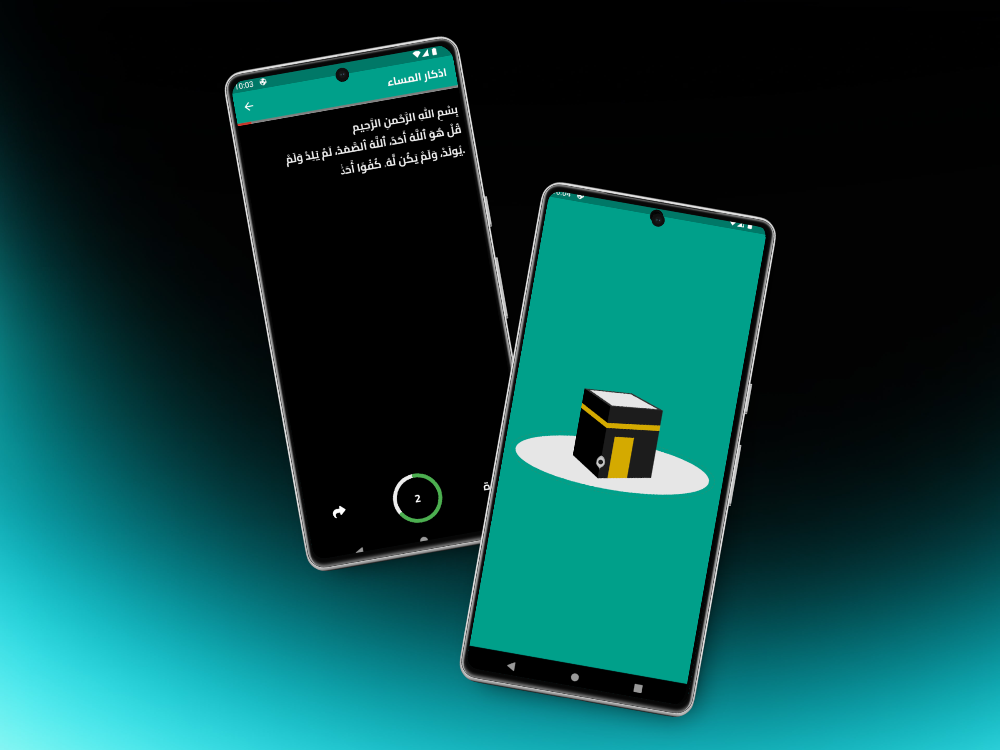
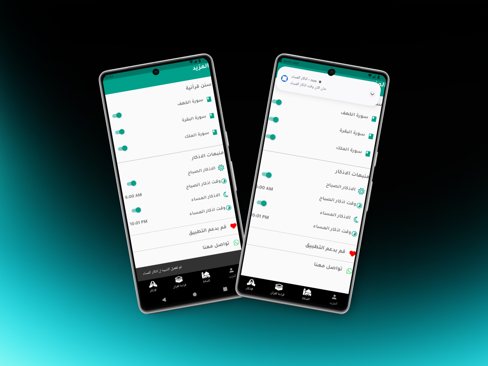
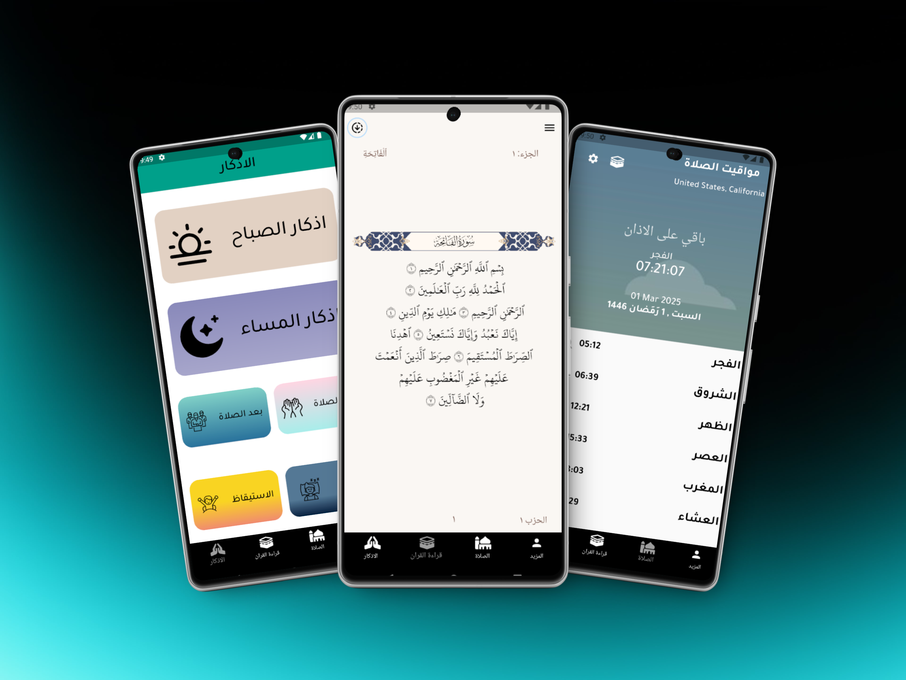
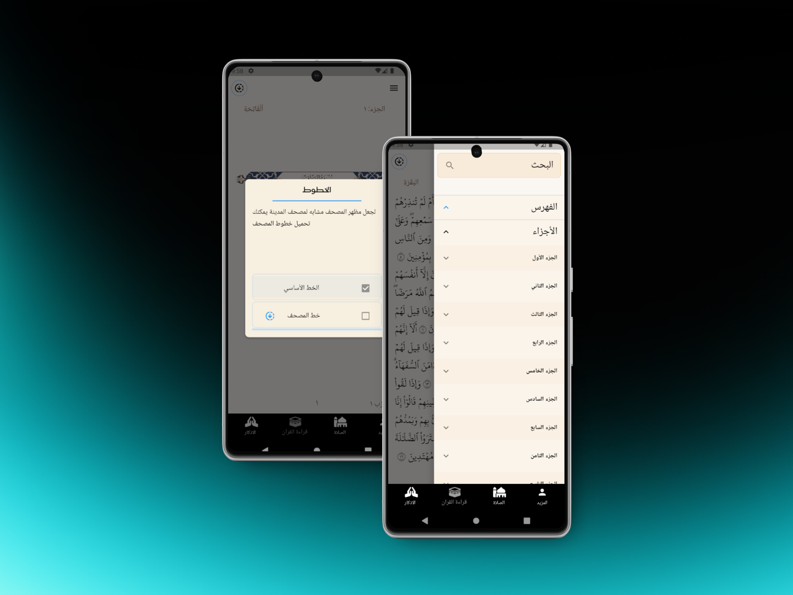

# Quran App

A new Flutter project.

## 📸 Screenshot

# Quran App

A new Flutter project.

## 📌 Features

- 📖 Read the Holy Quran with a beautiful and user-friendly interface.  
- 🔍 Search for specific Surahs and Ayahs.  
- 📌 Bookmark favorite verses for quick access.  
- 📜 Track your Quran reading progress using hive_storage.  
- 🔄 Works offline without an internet connection.  

## Getting Started
🌟 تطبيق القرآن الكريم 📖
تطبيق القرآن الكريم يوفر لك تجربة مميزة لقراءة القرآن الكريم والاستماع إليه، مع ميزات متقدمة تسهل عليك التفاعل مع القرآن في أي وقت ومكان.

📖 مميزات التطبيق
قراءة القرآن الكريم بسهولة
واجهة مستخدم سلسة وعصرية لقراءة القرآن الكريم.

إمكانية البحث عن السور والآيات بسرعة.

🕌 تحديد اتجاه القبلة
استخدام مستشعرات الجهاز وتقنيات متقدمة مثل flutter_qiblah لضمان دقة الاتجاه.

🔔 تنبيهات أوقات الصلاة
إشعارات دقيقة بمواقيت الصلاة بناءً على موقعك باستخدام flutter_local_notifications.

🌙 الوضع الليلي
واجهة مريحة للعين مع دعم الوضع الليلي لتجربة قراءة ممتعة في جميع الأوقات.

📌 حفظ العلامات والتقدم
تابع قراءتك بسهولة مع ميزة حفظ العلامات والانتقال السريع إلى آخر موضع توقفت عنده.

🎧 الاستماع إلى تلاوات متعددة
اختر من بين عدة قراء واستمع إلى التلاوات بأعلى جودة.

📍 حساب أوقات الصلاة تلقائيًا
يعتمد التطبيق على geolocator و geocoding لتحديد الموقع الجغرافي بدقة وحساب أوقات الصلاة المناسبة لك.

⚡ أداء سريع وعمل بدون إنترنت
بفضل hive لتخزين البيانات محليًا، يمكنك الوصول إلى القرآن الكريم وإدارة تقدمك دون الحاجة للاتصال بالإنترنت.

🎨 تصميم جذاب وتفاعلي
استخدام خطوط Google، أيقونات SVG، ورسوم متحركة (Lottie) لجعل التجربة أكثر سلاسة وجاذبية.

🔄 تنقل سلس بين الصفحات
يعتمد التطبيق على go_router لتوفير تجربة تصفح مرنة وسريعة بين الشاشات.

🛠️ إدارة الأذونات بذكاء
استخدام permission_handler لضمان تجربة آمنة وسلسة عند الحاجة للوصول إلى ميزات مثل الموقع الجغرافي.

📊 متابعة تقدمك في القراءة
شريط تقدم خطي ودائري لمساعدتك في تحقيق أهدافك اليومية.

✅ يعمل على جميع الأجهزة
التطبيق متوافق مع جميع الأجهزة الذكية ويدعم أحدث إصدارات Android و iOS.

📥 التثبيت
قم بتنزيل التطبيق من هنا (رابط التحميل).

افتح التطبيق واتبع التعليمات للإعداد الأولي.

استمتع بتجربة قراءة القرآن الكريم بشكل مميز!

🛠️ التقنيات المستخدمة
Flutter: لإطار العمل الأساسي.

Hive: للتخزين المحلي.

Geolocator & Geocoding: لتحديد الموقع وحساب أوقات الصلاة.

Flutter Local Notifications: لإشعارات أوقات الصلاة.

Lottie: للرسوم المتحركة.

Go Router: للتنقل بين الصفحات.

Permission Handler: لإدارة الأذونات.
